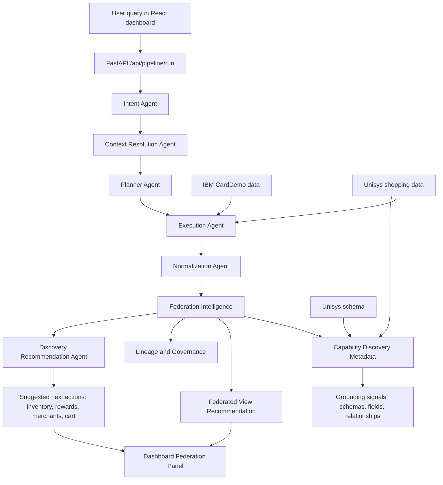

# COMMUNICATOR Application Handoff

## Purpose

COMMUNICATOR is an AI-driven data federation platform that connects IBM CardDemo-style mainframe data with a simulated Unisys ePortal. The application accepts natural-language requests, resolves which systems hold the required data, plans execution, runs mock read flows, normalizes results, and produces federation intelligence for business use cases such as Customer Shopping 360 and Loyalty & Rewards Optimization.

## Application Scope

The application contains these major parts:

- Frontend dashboard: React + Vite UI in `frontend/`.
- Backend API: FastAPI application in `app/main.py`.
- Intent Agent: Parses the user query into structured intent.
- Context Resolution Agent: Determines IBM and Unisys data locations.
- Planner Agent: Builds an execution plan from intent and context.
- Execution Agent: Executes safe mock IBM and Unisys steps.
- Normalization Agent: Converts execution output into canonical records.
- Federation Intelligence: Recommends federated views, returns lineage/governance, and suggests related follow-up explorations.
- Mock Unisys ePortal: Provides shopping behavior data, schema, MCP tools/resources, and guarded enrichment write APIs.
- IBM simulation data: Local datasets and parsed CardDemo assets under `data/ibm/` and `tools/cobol-jcl-parser/`.

## Current Demo Use Cases

1. Customer Shopping 360
   - IBM provides card transaction history and financial spend authority.
   - Unisys ePortal provides shopping enrichment: merchant, category, loyalty points, browsing time, and cart status.
   - The federation layer combines these on `customerId`.

3. Loyalty & Rewards Optimization
   - IBM provides actual customer spend.
   - Unisys provides `loyaltyPoints`, merchant, and category context.
   - Reward-point prompts now prefer the `loyalty_spend_correlation` federated view.

## Demo Dataset Coverage

The local data has been expanded so demos can show meaningful discovery across multiple customers, merchants, categories, reward-point patterns, cart states, and browsing behavior.

- IBM customers: 10
- IBM accounts: 10
- IBM transactions: 60, with 6 transactions per customer
- Unisys shopping enrichment records: 120, with 12 shopping events per customer
- Merchant coverage: Amazon, Flipkart, Swiggy, Zomato, Uber, Myntra, BigBasket, MakeMyTrip, Croma, BookMyShow, Nykaa, Decathlon
- Category coverage: electronics, food, travel, shopping, fashion, grocery, entertainment, beauty, fitness
- Cart states: completed, abandoned, wishlisted
- Phase-two inventory records: 12 product availability records linked to shopping merchants/categories

Source files:

- `data/ibm/customers.json`
- `data/ibm/accounts.json`
- `data/ibm/transactions.json`
- `data/unisys/shopping.json`
- `data/unisys/inventory.json`
- `generate_shopping_data.py`

## Flow Diagram



## Read Flow

The normal read path is:

1. User submits a query, for example: `Show reward points for customer 101`.
2. Intent Agent extracts task, entities, attributes, filters, and federation requirement.
3. Context Resolution Agent resolves IBM transaction data and Unisys shopping data.
4. Planner Agent creates a safe mock plan.
5. Execution Agent fetches mock IBM and Unisys records.
6. Normalization Agent maps records to canonical output.
7. Federation Intelligence recommends a business view and produces a federated result.
8. Discovery Recommendation Agent suggests useful next explorations without adding them to the current answer.

## Discovery Behavior

Discovery is schema and dataset driven, not hardcoded only from known demo assumptions. The user-facing behavior is recommendation-first: after answering the current query, the dashboard shows follow-up actions such as inventory, rewards, merchant analytics, and cart conversion.

The follow-up actions are generated by the LLM using the current intent, resolved context, and grounded capability metadata. A deterministic fallback exists only for no-key/LLM-disabled scenarios so the demo remains usable.

Important product rule: do not imply that a related capability was fetched in the current answer. For example, a shopping result may suggest inventory exploration, but inventory appears in the result only after the user asks that follow-up.

Current Unisys shopping data supports:

- `loyaltyPoints`: reward/loyalty point questions.
- `cartStatus`: cart conversion and abandonment analysis.
- `browsingSessionMinutes`: browsing-to-spend funnel analysis.
- `merchantCategory` and `category`: merchant/category intelligence.

Phase two adds inventory support:

- Inventory data is available through `data/unisys/inventory.json`.
- Inventory schema is exposed through `mock_eportal/schema/inventory_schema.json`.
- Inventory can be read through `/api/inventory` and MCP tool `get_inventory_data`.
- Inventory links to shopping behavior by merchant/category/merchantCategory.

Related implementation:

- `federation_intelligence/discovery.py`
- `federation_intelligence/recommendations.py`: LLM-based Discovery Recommendation Agent
- `federation_intelligence/agent.py`
- `federation_intelligence/view_recommender.py`
- `mock_eportal/schema/shopping_schema.json`
- `frontend/src/pages/ExecutionPage.tsx`

## Save / Update Flow

A feasible save/update path has been added for Unisys enrichment data only.

Supported ePortal write APIs:

- `POST /api/shopping`: creates a Unisys shopping enrichment event.
- `PATCH /api/shopping/enrichment`: updates writable enrichment fields on an existing event.

Writable fields:

- `loyaltyPoints`
- `browsingSessionMinutes`
- `cartStatus`
- `merchantCategory`

Guardrails:

- IBM remains the financial authority.
- Unisys `amount` must not be added to IBM `transactionAmount`.
- Write/update is limited to behavioral enrichment/context.
- Stable update key is `customerId + date + merchant`.

Related implementation:

- `mock_eportal/mcp_server.py`
- `mock_eportal/services/shopping_service.py`
- `app/api/federation_intelligence.py`

## LLM Model Used By Agents

The application agents use the shared model builder in:

- `intent_agent/config.py`

Provider:

- Google Gemini through `langchain_google_genai.ChatGoogleGenerativeAI`.

Primary configured model:

- `gemini-2.5-flash-lite`

Runtime fallback candidates:

- `gemini-2.5-flash-lite`
- `gemini-3-flash-preview`
- `gemini-2.0-flash-lite`

LLM settings:

- Temperature: `0`
- Retries: `0`
- Required environment variable: `GOOGLE_API_KEY` or `GEMINI_API_KEY`

Agents using this shared model builder:

- Intent Agent
- Context Resolution Agent
- Planner Agent
- Execution Agent
- Normalization Agent
- Federation Intelligence LLM refinement
- Agent API routes that initialize an Intent Agent

Notes:

- If Gemini initialization fails or no Gemini key is configured, agents fall back to deterministic/rule-based behavior where implemented.
- An `OPENAI_API_KEY` may exist in `.env`, but the current agent model builder uses Gemini for these agents.
- Do not commit API key values into documentation or code.

## API Summary

Backend FastAPI:

- `POST /api/pipeline/run`: full pipeline.
- `GET /api/pipeline/health`: pipeline health.
- `POST /api/intent/extract`: intent extraction.
- `POST /api/context/resolve`: context resolution.
- `POST /api/planner/run`: planner execution.
- `POST /api/execution/run`: execution agent.
- `POST /api/normalization/run`: normalization agent.
- `POST /api/federation/analyze`: federation intelligence.
- `POST /api/federation/execute`: execute a federated view.
- `GET /api/federation/views`: federated view catalog.
- `POST /api/federation/discover`: grounded capability discovery.
- `GET /api/federation/write-feasibility`: save/update feasibility summary.

Mock ePortal:

- `GET /api/shopping`: read shopping behavior data.
- `GET /api/inventory`: read inventory availability data.
- `POST /api/shopping`: create shopping enrichment event.
- `PATCH /api/shopping/enrichment`: update shopping enrichment fields.
- `GET /api/schema/shopping`: shopping schema.
- `GET /api/schema/inventory`: inventory schema.
- `GET /api/entity-mapping`: IBM/Unisys mapping.
- `GET /api/capabilities`: available and missing ePortal capabilities.
- MCP tools/resources are also exposed through the ePortal server.

## Local Run

Backend:

```bash
uvicorn app.main:app --reload --port 8000
```

Frontend:

```bash
cd frontend
npm install
npm run dev
```

Mock ePortal:

```bash
python mock_eportal/mcp_server.py
```

## Verification Already Performed

- JSON validation passed for `mock_eportal/schema/shopping_schema.json`.
- Python syntax parse checks passed for modified backend files.
- Frontend production build passed with `npm run build`.
- Federation test confirmed reward-point requests select `loyalty_spend_correlation`.
- Discovery test confirmed inventory is available after phase-two onboarding when explicitly requested.
- Recommendation smoke check confirmed shopping queries produce next-action prompts for inventory, rewards, merchant analytics, and cart conversion.

## AI Usage Disclosure

This handoff and the recent capability-discovery/save-update changes were prepared with assistance from OpenAI Codex in the local development workspace. The application code itself uses Gemini models for its runtime agents as described above.
