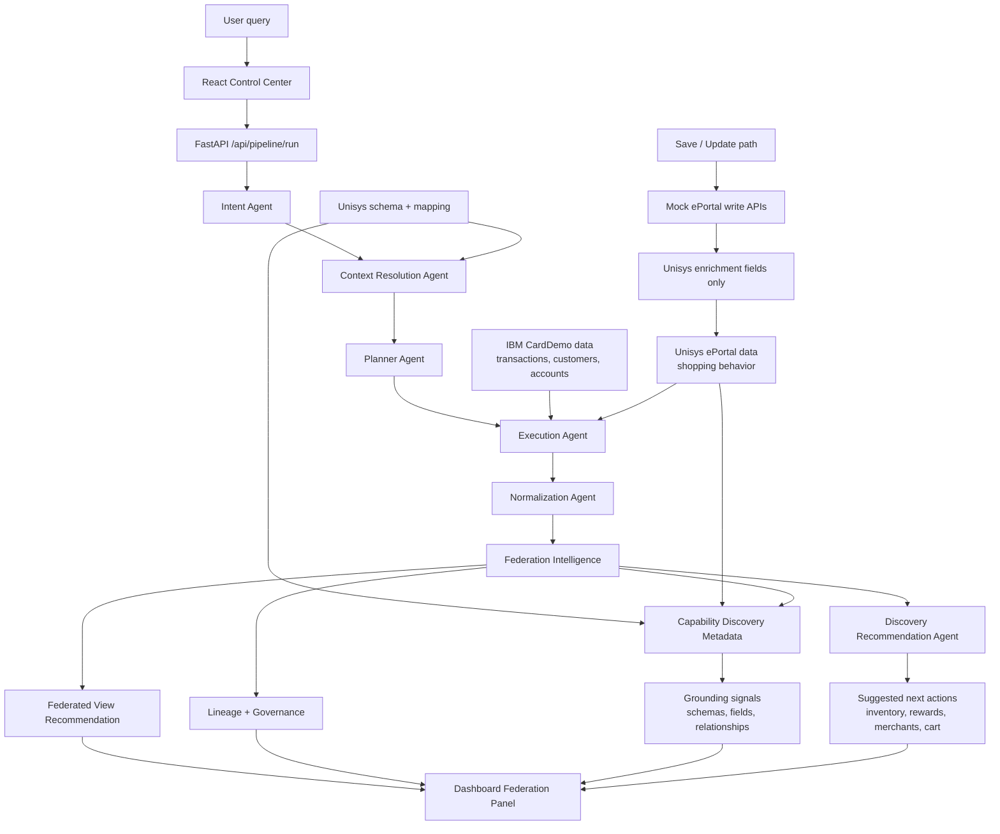

# COMMUNICATOR - AI Data Federation Platform

COMMUNICATOR is an AI-driven data federation platform for querying IBM CardDemo-style mainframe data and simulated Unisys ePortal data through a multi-agent pipeline.

The current demo focuses on AWS Card Dataset use cases:

- Customer Shopping 360
- Loyalty & Rewards Optimization
- Fraud & Risk Detection

IBM is treated as the financial authority for transaction amounts. Unisys ePortal provides behavioral enrichment such as merchant, category, loyalty points, browsing time, cart status, and merchant category.

## Goal

The application lets a user ask a natural-language question and then:

1. Understand the intent.
2. Resolve which systems contain the data.
3. Plan a safe execution flow.
4. Fetch mock IBM and Unisys records.
5. Normalize records into a common shape.
6. Recommend a federated business view.
7. Suggest related explorations the user may want to try next.
8. Show lineage, governance, warnings, and final output in the UI.

## Flow Diagram



## Architecture

```text
Frontend Dashboard
  -> FastAPI Backend
    -> Intent Agent
    -> Context Resolution Agent
    -> Planner Agent
    -> Execution Agent
    -> Normalization Agent
    -> Federation Intelligence
      -> Capability Discovery Metadata
      -> Discovery Recommendation Agent
      -> View Recommendation
      -> Lineage and Governance
```

## Core Components

### Intent Agent

Converts a user query into structured intent:

- task
- entities
- attributes
- filters
- systems
- metric
- federation requirement

Example:

```json
{
  "task": "analyze",
  "entities": ["transaction", "shopping"],
  "attributes": ["reward points"],
  "filters": {
    "conditions": [
      { "field": "customerId", "value": 101 }
    ]
  },
  "systems": ["ibm", "unisys"],
  "requires_federation": true
}
```

### Context Resolution Agent

Determines where the requested data exists.

It checks:

- IBM CardDemo data and parsed COBOL/JCL metadata.
- Unisys ePortal schema and API metadata.
- Entity mappings between IBM and Unisys.

### Planner Agent

Creates an execution plan from intent and context.

### Execution Agent

Runs the safe mock execution flow and collects IBM + Unisys outputs.

### Normalization Agent

Converts system-specific outputs into canonical records used by federation.

### Federation Intelligence

Discovers cross-system relationships, recommends federated views, executes view logic, and returns:

- top view
- federated result
- capability discovery
- lineage
- governance
- confidence
- reasoning

## Current Federated Views

- `customer_spend_enriched`
- `merchant_category_spend`
- `loyalty_spend_correlation`
- `cart_conversion_analysis`
- `browsing_to_spend_funnel`
- `fraud_risk_assessment`

Reward-point or loyalty prompts are routed toward `loyalty_spend_correlation`.
Fraud/risk prompts are routed toward `fraud_risk_assessment`.

## Demo Dataset

The local demo dataset has been expanded for more realistic discovery and federation testing.

- IBM customers: 10
- IBM accounts: 10
- IBM transactions: 62, including two intentionally suspicious customer 103 transactions for fraud/risk testing
- Unisys shopping enrichment records: 120, with 12 shopping events per customer
- Merchants represented: Amazon, Flipkart, Swiggy, Zomato, Uber, Myntra, BigBasket, MakeMyTrip, Croma, BookMyShow, Nykaa, Decathlon
- Categories represented: electronics, food, travel, shopping, fashion, grocery, entertainment, beauty, fitness
- Shopping enrichment includes loyalty points, browsing minutes, cart status, and merchant category

The Unisys shopping records are generated from IBM transaction customer/date/amount context by `generate_shopping_data.py`, then enriched with deterministic merchant, category, loyalty, browsing, and cart behavior. The Unisys amount remains behavioral/reference context and must not be added to IBM spend.

## Fraud & Risk Detection

Fraud and risk prompts join IBM transactions with same-day Unisys shopping behavior and route to the `fraud_risk_assessment` view.

The scoring logic is deterministic and explainable. It evaluates:

- high-value outliers against the customer's IBM transaction baseline
- IBM charges with missing same-day Unisys shopping context
- charges paired with abandoned or wishlisted carts
- high spend with very short browsing time
- IBM ledger amount divergence from Unisys observed shopping amount

Each transaction receives a risk score, band, verdict, fired rules, and evidence. IBM remains the financial authority; Unisys is used only as behavioral validation context.

## Capability Discovery

The Unisys side is now discovery-aware. The system inspects available schema and dataset fields for grounding, but the product behavior is conversational: it answers the current request first, then suggests useful follow-up explorations.

The key distinction is that suggestions are not treated as current-query results. For example, a shopping query may show a button for inventory exploration, but it should not claim inventory was fetched unless the user asks that follow-up.

Suggested next actions are generated by the LLM from the current intent, resolved context, and grounded capability metadata. A small fallback list is used only when LLM execution is disabled or unavailable.

Grounding signals currently available from shopping data:

- Loyalty/reward points: available through `loyaltyPoints`.
- Cart behavior: available through `cartStatus`.
- Browsing behavior: available through `browsingSessionMinutes`.
- Merchant/category intelligence: available through `merchant`, `category`, and `merchantCategory`.
- Inventory: available as a follow-up exploration through the phase-two inventory schema and dataset.

After an answer, the Federation panel also shows suggested next actions such as:

- View Inventory Insights
- Analyze Reward Points
- View Merchant Analytics
- Inspect Cart Conversion

These are follow-up prompts. They help users discover what else is possible without pretending that every related capability was part of the original request.

Discovery recommendation implementation:

- `federation_intelligence/discovery.py`
- `federation_intelligence/recommendations.py`: LLM-based Discovery Recommendation Agent
- `federation_intelligence/agent.py`
- `mock_eportal/schema/shopping_schema.json`

## Save / Update Support

A feasible save/update path exists for Unisys behavioral enrichment data.

Supported write APIs on the mock ePortal:

- `POST /api/shopping`
- `PATCH /api/shopping/enrichment`

Writable fields:

- `loyaltyPoints`
- `browsingSessionMinutes`
- `cartStatus`
- `merchantCategory`

Guardrails:

- IBM remains the financial source of truth.
- Unisys `amount` is not added to IBM `transactionAmount`.
- Writes are limited to Unisys enrichment/context data.
- Updates use `customerId + date + merchant` as the stable event key.

## Observability

The pipeline emits built-in observability data for every `/api/pipeline/run` request:

- request correlation through `X-Request-ID`
- end-to-end pipeline duration
- per-stage timings for intent, context, planner, execution, normalization, and federation
- stage reasoning for dashboard explainability
- domain checks for join-key match rate, IBM amount authority, governance violations, LLM fallback, and record counts
- optional OpenTelemetry spans and Jaeger/OTLP export
- optional LangSmith trace contexts around pipeline stages
- LLM token/cost tracking when provider metadata is available
- SQLite persistence in `data/observability.sqlite3`
- live server-sent events for stage and LLM activity

Runtime endpoints:

- `GET /metrics`: Prometheus-compatible metrics
- `GET /api/observability/summary`: aggregate run summary
- `GET /api/observability/runs`: recent pipeline runs
- `GET /api/observability/events`: recent live events
- `GET /api/observability/stream`: live SSE event stream
- `GET /api/observability/llm-usage`: persisted LLM usage entries

The frontend Control Center includes an **Observability** panel that displays the latest request ID, timings, reasoning, and domain health checks.

External observability assets:

- `observability/grafana_dashboard.json`
- `observability/prometheus_alerts.yml`
- `observability/README.md`

## LLM Model Used

Agents use the shared model builder in `intent_agent/config.py`.

Provider:

- Google Gemini through `langchain_google_genai.ChatGoogleGenerativeAI`

Primary configured model:

- `gemini-2.5-flash-lite`

Runtime fallback candidates:

- `gemini-2.5-flash-lite`
- `gemini-3-flash-preview`
- `gemini-2.0-flash-lite`

Settings:

- Temperature: `0`
- Retries: `0`
- Environment variable: `GOOGLE_API_KEY` or `GEMINI_API_KEY`

If no Gemini key is available or model initialization fails, agents use deterministic fallback behavior where implemented.

## API Summary

Backend API:

- `POST /api/pipeline/run`
- `GET /api/pipeline/health`
- `POST /api/intent/extract`
- `POST /api/context/resolve`
- `POST /api/planner/run`
- `POST /api/execution/run`
- `POST /api/normalization/run`
- `POST /api/federation/analyze`
- `POST /api/federation/execute`
- `GET /api/federation/views`
- `POST /api/federation/discover`
- `GET /api/federation/write-feasibility`

Mock ePortal:

- `GET /api/shopping`
- `GET /api/inventory`
- `POST /api/shopping`
- `PATCH /api/shopping/enrichment`
- `GET /api/schema/shopping`
- `GET /api/schema/inventory`
- `GET /api/entity-mapping`
- `GET /api/capabilities`

## Tech Stack

- Backend: Python, FastAPI
- Agent orchestration: LangChain
- LLM provider: Google Gemini
- Frontend: React, Vite, TypeScript
- Mock Unisys service: FastAPI + MCP server
- IBM simulation: CardDemo datasets, COBOL/JCL parser outputs

## Getting Started

Install Python dependencies:

```bash
pip install -r requirements.txt
```

Create `.env`:

```env
GOOGLE_API_KEY=your_key
```

Run backend:

```bash
uvicorn app.main:app --reload --port 8000
```

Run frontend:

```bash
cd frontend
npm install
npm run dev
```

Run mock ePortal:

```bash
python mock_eportal/mcp_server.py
```

## Example Queries

```text
Show shopping data for customer 101 on 2026-03-10
```

```text
Show reward points for customer 101
```

```text
Run fraud and risk assessment for customer 103
```

```text
We know shopping data is available. Based on this, check whether related inventory data exists.
```

Expected discovery behavior:

- A normal shopping query should answer with shopping records first and show suggested next actions below the response.
- Inventory should appear as a follow-up exploration unless the user explicitly asks to check or fetch inventory.
- If the user explicitly asks whether inventory exists, the system can report inventory as available because phase-two inventory schema/data has been onboarded.

## Handoff

See [HANDOFF.md](./HANDOFF.md) for the full application handoff, model usage details, flow notes, and AI usage disclosure.

## License

MIT License
